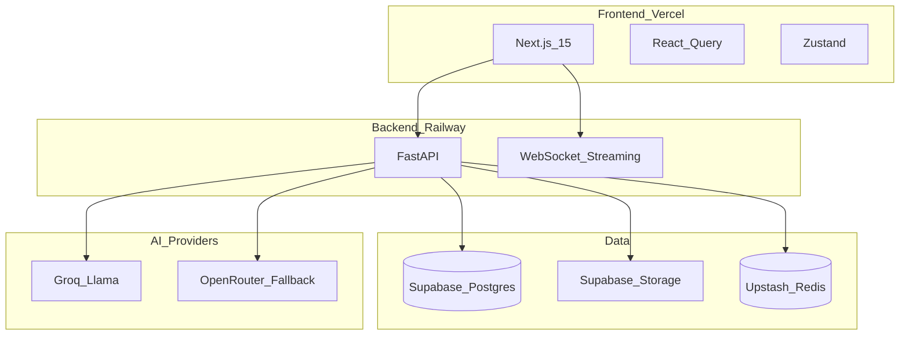
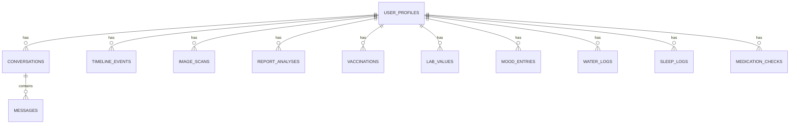

# Architecture

## ER diagram

## Security notes

- JWT validation via Supabase JWT secret when configured
- Rate limiting (Redis with in-memory fallback)
- Audit logs for search/profile actions
- Medical disclaimer on all AI surfaces
- Private storage buckets recommended for images/reports
